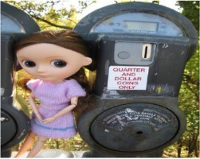

# Data- 606 Capstone Project - Image Caption Generator
### Author: Dikshitha Kavali

In general, an image caption generator creates descriptions of what is happening in a given image. It comes naturally to humans to be able to focus on the key details of an image and briefly explain it using only a few words.   It is feasible to train a model to carry out this activity using tools like computer vision and natural language processing. This project will investigate this.

The ability to generate image captions has applications as it can aid the blind in understanding their environment, Used in CCTV survelliance etc.

### Abstract:

The fusion of computer vision and natural language processing has received a lot of interest recently due to the introduction of deep learning. This field is represented by image captioning, which trains a computer to comprehend an image's visual information using one or more sentences. The ability to analyze the state, the properties, and the relationship between these objects is also necessary for the meaningful description generating process of high level image semantics. 

### Dataset:

Multiple Sources(Kaggle, OpenSource etc) Dataset Size ~ 9 GB
Kaggle:https://www.kaggle.com/datasets/hsankesara/flickr-image-dataset

This dataset has 30K images and had the description CSV file which holds 5 desciptions for each image. This Dataset will be cutdown as it is very high in memory and will divide it into test and train datasets with 80% data in train and 20% data in test folders.

### Model:

The input for the model will be Image and the Label/Output is the description of the image. The model will be trained using OpenCV, CNN-RNN, NLP algorithms. This is a kind of encoding-decoding. the encoder here will be Neural networks such as LSTM and the decoder will be the CNN as it will detect the information from the image. 

### Deployment:

Web application to accept an image and process it, after successful upload of the image, the model predicts the caption for the image.

### References:

https://www.researchgate.net/publication/329037107_Image_Captioning_Based_on_Deep_Neural_Networks

