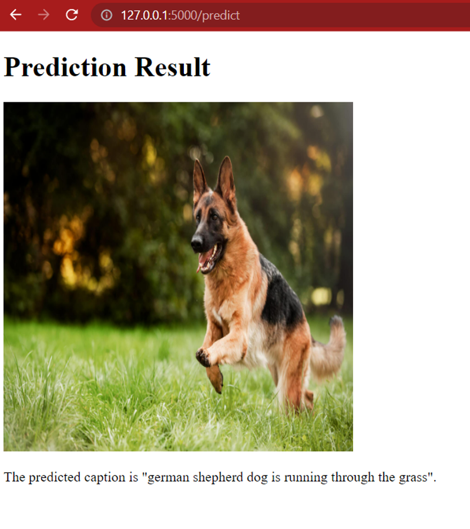

## Image Caption Generator

### Author: Dikshitha Kavali

Youtube video link: https://youtu.be/FyN11uKtMek

Presentation link: https://github.com/DATA-606-SPRING-2023-THU/dikshitha_data606/blob/main/docs/capstone.pptx

An image caption generator is a deep learning model that generates natural language captions for images. The goal of image captioning is to teach a machine to describe the content of an image in a way that is understandable and relevant to humans. Image caption generators typically using convolutional neural networks (CNNs) to extract features from the image and a language model such as a recurrent neural network (RNN) or transformer to generate a caption. This technology has many potential applications, such as improving accessibility for people with visual impairments, enhancing search engine functionality, and improving social media content.

### Dataset:

Kaggle: https:https://www.kaggle.com/datasets/adityajn105/flickr8k

This dataset has 8K images and had the description CSV file which holds 5 descriptions for each image. The images were chosen from six different Flickr groups, and tend not to contain any well-known people or locations, but were manually selected to depict a variety of scenes and situations. This Dataset is divide into test and train datasets with 80% data in train and 20% data in test folders.

### Pre-processing:

Explored the dataset using Python pandas and NumPy libraries. 
Each image has 5 descriptions related to it. 

Cleaning the dataset descriptions. Replacing everything which is not an alphabet with a space. 

### Encoding training and testing image sets
Full dataset is made into 80-20 split. Training and testing data set is encoded and then stored in a pickle object.

#### DataLoader Class: 
For each input-output pair, the function pads the input sequence to max_len length using pad_sequences function from Keras, converts the output token to one-hot encoded vector using to_categorical function, and appends the input sequence, encoded image feature, and output vector to the corresponding lists X1, X2, and y. 

### Model Training:
This code trains a deep-learning model for image captioning for a specified number of epochs (here, 20). The train function uses a data_generator function to generate batches of training data for the model. The data_generator function takes in the following parameters:

train_descriptions: A dictionary containing image names as keys and corresponding lists of captions as values.
encoding_train: A dictionary containing image names as keys and corresponding image feature vectors as values.
word_to_idx: A dictionary mapping each word in the vocabulary to a unique integer index.
max_len: The maximum length of the captions, after which they will be truncated.
batch_size: The number of samples per batch.
The train function initializes a generator object using the data_generator function and then fits the model to the data for one epoch. After each epoch, the model is saved to a file in the model_weights directory with a unique file name based on the epoch number. This allows the model to be restored at a later time and continue the training from where it left off

#### Modeling:
- The input for the model will be the Image and the Label/Output is the description of the image. The model will be trained using Resnet 50 model. 
- ResNet-50 consists of 50 layers, including convolutional layers, max-pooling layers, and fully connected layers. The key innovation in ResNet-50 is the use of residual connections, which allow the network to learn residual mappings instead of trying to fit an exact mapping between inputs and outputs.

#### How does the image caption generator work?
An image caption generator using ResNet 50 model typically involves the following steps:
1. Data collection: Gather a large dataset of images with corresponding captions.
2. Data pre-processing: Resize and normalize the images and tokenize the captions.
3. Model training: Fine-tune the ResNet 50 model on the image-caption pairs using a language model to predict the captions.
4. Caption generation: Pass an image through the trained ResNet 50 model and generate a caption using the language model.

### Applications:
- Image caption generator using ResNet 50 model has many potential applications, such as improving accessibility for people with visual impairments, enhancing search engine functionality, and improving social media content.
- Companies such as Google, Facebook, and Microsoft are using image captioning technology to improve their services.

### Results:
During our experimentation, we trained our model for different numbers of epochs: 1, 10, and 30. Based on the captions generated by the model, we made the following observations:

1. Given that our dataset primarily consists of images containing people, the model demonstrates a tendency to easily recognize and mention the presence of people. However, it also sometimes generates captions mentioning people in images where no people are actually present.
2. Similarly, the model exhibits proficiency in identifying common objects such as balls and grass, likely due to their frequent occurrence in the dataset alongside people.
3. When trained for only one epoch, the model's caption generation is limited. It learns only a few words and tends to generate the same caption for different images, although there are exceptions to this behavior.

These observations shed light on the model's strengths and limitations, emphasizing the influence of dataset composition and training duration on its performance in generating accurate and diverse captions.

### Deployment:
Creating an Application using Flask.
- A Flask app for an image caption generator is a web application built using the Flask web framework and a pre-trained image captioning model. The app allows users to upload an image and generates a caption for the uploaded image using the pre-trained model.

### Future Work:
- To improve its accuracy, we can try by increasing number of epochs to 50, 100 with help of more powerful computational resources.
- Using a different/more diversified dataset can help the model learn better.

### Challenges overcome/Lessons learned:
- We encountered a significant challenge with runtime while training our model using a CPU, as each epoch took more than 4 hours to complete. To address this issue, we made the decision to utilize a GPU for training, resulting in a substantial reduction in runtime to approximately 10-15 minutes per epoch. However, due to limited availability of GPUs, we were only able to leverage this accelerated training for a portion of our experiments.
- This situation provided us with an opportunity to delve into the fundamental concepts of deep learning, natural language processing (NLP), and the PyTorch library. We gained valuable experience in working with these technologies and expanded our understanding of their principles and functionalities.

### Scope of Image Generator Using Shared Hosting:
- Deploying a Flask application on a shared hosting platform is a simple and effective way to make your application available to a wider audience. To get started, we’ll need to purchase a shared hosting plan from a provider that supports Python and Flask applications. Once we’ve set up your account and Python environment, we can upload your Flask application code and configure your server to use the WSGI protocol to communicate with our application.
- Deploying a Flask application on a shared hosting platform offers several advantages, including flexibility, scalability, and ease of use. It allows users to access your application with just a click, making it more accessible to a wider audience. Additionally, shared hosting plans are typically affordable and easy to set up, making them an ideal choice for small to medium-sized applications

### Results:

This is the obtained result after training the model.

